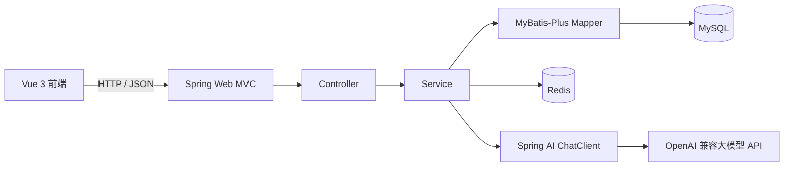

# AI TODO 智能任务管理系统


AI TODO 是一个前后端分离的智能任务管理系统。

项目在传统 TODO 管理能力之上接入大语言模型，使 AI 能够读取用户真实的任务、截止时间、优先级、完成状态和任务步骤，并结合用户当前的时间、精力或其他要求，给出具有上下文的任务安排建议。

系统目前采用单体 Spring Boot 架构，重点展示 REST API 设计、数据建模、JWT 身份认证、Redis 缓存与限流、前后端协作，以及大语言模型在真实业务数据中的应用。

---

## 项目功能

### 用户与身份认证

- 用户注册
- 用户名或邮箱登录
- BCrypt 密码加密存储
- JWT 登录凭证签发与校验
- 根据客户端 IP 的登录频率限制

### 任务管理

- 创建、查询、修改和删除任务
- 修改任务完成状态
- 支持以下任务状态：
  - `TODO`：待办
  - `IN_PROGRESS`：进行中
  - `DONE`：已完成
- 支持以下优先级：
  - `LOW`：低
  - `MEDIUM`：中
  - `HIGH`：高
- 设置任务描述和截止时间
- 按状态和优先级筛选任务
- 根据标题或描述搜索任务
- 分页查询任务列表
- 查询指定时间范围内即将截止的任务

### 任务概览

系统会统计并展示：

- 任务总数
- 待办任务数
- 进行中任务数
- 已完成任务数
- 高优先级任务数
- 今日截止任务数
- 已逾期任务数

任务统计结果会缓存到 Redis 中，并在任务创建、编辑、修改状态或删除后主动清除对应缓存。

### 任务步骤

- 为任务创建执行步骤
- 查询任务的全部步骤
- 修改步骤标题
- 标记步骤是否完成
- 删除任务步骤
- 展示任务步骤完成进度
- 删除任务时级联删除对应步骤

### AI 任务安排建议

用户可以输入当前的时间、精力、可用时长或其他情况，例如：

- “我现在只有 30 分钟，应该先做什么？”
- “我今天精力一般，帮我安排一些容易推进的任务。”
- “根据截止时间和优先级安排今天剩余时间。”

系统会将以下上下文交给大语言模型：

- 当前时间
- 用户输入
- 未完成任务
- 任务状态
- 任务优先级
- 截止时间
- 未完成的任务步骤

AI 会根据这些真实数据推荐最多部分适合优先处理的任务或步骤，并简单说明推荐理由。

### AI 任务拆解

系统可以根据任务标题、描述、优先级、截止时间和已有步骤，生成一组可执行的步骤草稿。

AI 生成的内容不会直接写入数据库。用户可以先查看、选择和调整草稿，再决定保存哪些步骤。

这种确认机制可以避免 AI 在未经用户同意的情况下直接修改任务数据。

### Redis 限流

当前系统实现了两种固定时间窗口限流：

| 场景 | 限流维度 | 当前限制 |
| --- | --- | --- |
| 用户登录 | 客户端 IP | 每分钟最多 5 次 |
| AI 请求 | 用户 ID | 每分钟最多 5 次 |

---

## 前端页面

前端目前提供以下主要视图：

- 全部任务
- 我的一天
- 计划内任务
- 重要任务
- 进行中任务
- 已完成任务

页面支持：

- 登录与注册
- 创建和编辑任务
- 快速修改任务状态
- 搜索任务
- 状态与优先级筛选
- 分页浏览
- 任务详情侧栏
- 任务步骤进度展示
- 即将截止任务提醒
- AI 任务建议
- AI 步骤草稿生成与选择
- 统一的后端错误信息处理

---

## 系统架构



后端采用常见的分层结构：

```text
Controller
    ↓
Service
    ↓
Mapper
    ↓
MySQL
```

Redis 主要用于：

```text
任务统计缓存
登录频率限制
AI 请求频率限制
```

---

## 技术栈

### 后端

| 技术 | 用途 |
| --- | --- |
| Java 17 | 后端开发语言 |
| Spring Boot 4.1.0 | 应用基础框架 |
| Spring Web MVC | REST API 开发 |
| Spring Validation | 请求参数校验 |
| MyBatis-Plus 3.5.16 | 数据访问与分页查询 |
| MySQL | 业务数据持久化 |
| Redis | 缓存与请求限流 |
| Spring Data Redis | Redis 客户端 |
| Spring AI 2.0.0 | 大语言模型调用 |
| OpenAI Compatible API | 对接 DeepSeek 等兼容服务 |
| java-jwt 4.5.2 | JWT 签发与校验 |
| BCrypt | 密码加密 |
| Jackson | JSON 序列化与反序列化 |
| Maven | 项目构建与依赖管理 |
| Lombok | 简化 Java 数据类 |

### 前端

| 技术 | 用途 |
| --- | --- |
| Vue 3 | 前端框架 |
| Vite 7 | 开发服务器与项目构建 |
| JavaScript | 页面逻辑 |
| Fetch API | 后端接口调用 |
| Lucide Vue | 页面图标 |
| 原生 CSS | 页面样式与响应式布局 |

---

## 项目目录

```text
ai-todo
├── backend
│   ├── database
│   │   └── schema.sql
│   ├── src/main/java/com/qijx/aitodo
│   │   ├── ai
│   │   │   ├── controller
│   │   │   ├── dto
│   │   │   └── service
│   │   ├── common
│   │   │   └── config
│   │   ├── task
│   │   │   ├── controller
│   │   │   ├── dto
│   │   │   ├── entity
│   │   │   ├── mapper
│   │   │   └── service
│   │   ├── user
│   │   │   ├── controller
│   │   │   ├── dto
│   │   │   ├── entity
│   │   │   ├── mapper
│   │   │   └── service
│   │   └── AiTodoApplication.java
│   └── pom.xml
├── frontend
│   ├── src
│   │   ├── services
│   │   │   └── api.js
│   │   ├── App.vue
│   │   ├── main.js
│   │   └── styles.css
│   ├── package.json
│   └── vite.config.js
└── README.md
```

---

## 数据模型

### users

存储用户账号与认证相关信息。

| 字段 | 说明 |
| --- | --- |
| `id` | 用户 ID |
| `username` | 用户名 |
| `email` | 邮箱 |
| `password_hash` | BCrypt 密码摘要 |
| `status` | 用户状态 |
| `created_at` | 创建时间 |
| `updated_at` | 更新时间 |

### tasks

存储用户任务。

| 字段 | 说明 |
| --- | --- |
| `id` | 任务 ID |
| `user_id` | 所属用户 ID |
| `title` | 任务标题 |
| `description` | 任务描述 |
| `status` | 任务状态 |
| `priority` | 任务优先级 |
| `due_at` | 截止时间 |
| `created_at` | 创建时间 |
| `updated_at` | 更新时间 |

### task_steps

存储任务的执行步骤。

| 字段 | 说明 |
| --- | --- |
| `id` | 步骤 ID |
| `task_id` | 所属任务 ID |
| `title` | 步骤标题 |
| `completed` | 是否完成 |
| `created_at` | 创建时间 |
| `updated_at` | 更新时间 |

数据关系：

```text
users 1 ────── N tasks
tasks 1 ────── N task_steps
```

---

## 本地运行

### 环境要求

请先安装以下环境：

- JDK 17
- Node.js
- MySQL
- Redis
- Git

AI 功能还需要一个 OpenAI API 兼容的大语言模型服务，我这里使用的例子是 DeepSeek。

### 1. 克隆项目

```bash
git clone https://github.com/jingxiangqi18/ai-todo.git
cd ai-todo
```

### 2. 创建数据库

登录 MySQL 后创建数据库：

```sql
CREATE DATABASE ai_todo
    CHARACTER SET utf8mb4
    COLLATE utf8mb4_unicode_ci;
```

选择数据库：

```sql
USE ai_todo;
```

然后执行数据库初始化脚本：

```text
backend/database/schema.sql
```

当前数据库脚本和 Java 实体之间存在需要统一的字段定义。执行原始脚本后，可以运行：

ALTER TABLE tasks
    MODIFY COLUMN title VARCHAR(100) NOT NULL;

第二条用于统一任务标题的后端校验长度与数据库字段长度。

### 3. 启动 Redis

确认 Redis 已在本机运行，默认连接地址为：

```text
localhost:6379
```

可以使用以下命令检查：

```bash
redis-cli ping
```

正常情况下会返回：

```text
PONG
```

### 4. 配置后端

项目没有提交包含密钥的 `application.properties`。请创建：

```text
backend/src/main/resources/application.properties
```

参考配置：

```properties
spring.application.name=ai-todo
server.port=8080

# MySQL
spring.datasource.url=jdbc:mysql://localhost:3306/ai_todo?serverTimezone=Asia/Shanghai&characterEncoding=utf8&useSSL=false&allowPublicKeyRetrieval=true
spring.datasource.username=root
spring.datasource.password=your_mysql_password
spring.datasource.driver-class-name=com.mysql.cj.jdbc.Driver

# Redis
spring.data.redis.host=localhost
spring.data.redis.port=6379

# JWT
app.jwt.secret=replace_this_with_a_long_random_secret
app.jwt.expiration-minutes=1440

# OpenAI-compatible model
spring.ai.openai.api-key=${AI_API_KEY}
spring.ai.openai.base-url=${AI_BASE_URL:https://api.deepseek.com}
spring.ai.openai.chat.options.model=${AI_MODEL:deepseek-chat}
```

建议通过环境变量保存 API Key，代替直接写入配置文件。

Linux、macOS 或 WSL：

```bash
export AI_API_KEY=your_api_key
```

Windows PowerShell：

```powershell
$env:AI_API_KEY="your_api_key"
```

使用其他 OpenAI 兼容服务时，可以同时设置：

```bash
export AI_BASE_URL=https://your-api.example.com
export AI_MODEL=your-model-name
```

### 5. 启动后端

进入后端目录：

```bash
cd backend
```

Linux、macOS 或 WSL：

```bash
./mvnw spring-boot:run
```

Windows：

```powershell
mvnw.cmd spring-boot:run
```

后端默认运行在：

```text
http://localhost:8080
```

### 6. 启动前端

打开另一个终端：

```bash
cd frontend
npm install
npm run dev
```

前端默认运行在：

```text
http://localhost:5173
```

开发环境会把 `/api` 请求代理到：

```text
http://localhost:8080
```

如果后端运行在其他地址，可以在 `frontend` 目录创建 `.env`：

```properties
VITE_API_PROXY_TARGET=http://localhost:8081
```

---

## API 概览

除注册和登录外，其余接口通常需要携带：

```http
Authorization: Bearer <JWT_TOKEN>
```

### 用户接口

| 方法 | 路径 | 说明 |
| --- | --- | --- |
| `POST` | `/api/users/register` | 注册用户 |
| `POST` | `/api/users/login` | 用户登录 |
| `GET` | `/api/users/me` | 查询当前用户 |

注册请求示例：

```json
{
  "username": "jakin",
  "email": "jakin@example.com",
  "password": "123456"
}
```

登录请求示例：

```json
{
  "account": "jakin",
  "password": "123456"
}
```

### 任务接口

| 方法 | 路径 | 说明 |
| --- | --- | --- |
| `POST` | `/api/tasks` | 创建任务 |
| `GET` | `/api/tasks` | 分页查询任务 |
| `GET` | `/api/tasks/stats` | 查询任务统计 |
| `GET` | `/api/tasks/reminders` | 查询即将截止任务 |
| `GET` | `/api/tasks/{id}` | 查询任务详情 |
| `PATCH` | `/api/tasks/{id}` | 编辑任务 |
| `PATCH` | `/api/tasks/{id}/status` | 修改任务状态 |
| `DELETE` | `/api/tasks/{id}` | 删除任务 |

任务列表支持以下查询参数：

| 参数 | 说明 |
| --- | --- |
| `status` | 按任务状态筛选 |
| `priority` | 按优先级筛选 |
| `keyword` | 搜索标题或描述 |
| `page` | 页码，默认值为 1 |
| `size` | 每页数量，范围为 1 至 50 |

创建任务示例：

```json
{
  "title": "完善项目 README",
  "description": "补充项目介绍、技术栈和启动方式",
  "priority": "HIGH",
  "dueAt": "2026-07-30T18:00:00"
}
```

更新任务状态：

```json
{
  "status": "IN_PROGRESS"
}
```

查询未来 60 分钟内即将截止的任务：

```http
GET /api/tasks/reminders?minutes=60
```

可查询的时间范围为 1 至 1440 分钟。

### 任务步骤接口

| 方法 | 路径 | 说明 |
| --- | --- | --- |
| `POST` | `/api/tasks/{taskId}/steps` | 创建任务步骤 |
| `GET` | `/api/tasks/{taskId}/steps` | 查询任务步骤 |
| `PATCH` | `/api/tasks/{taskId}/steps/{stepId}` | 修改任务步骤 |
| `DELETE` | `/api/tasks/{taskId}/steps/{stepId}` | 删除任务步骤 |

创建步骤示例：

```json
{
  "title": "整理项目功能列表"
}
```

修改步骤示例：

```json
{
  "title": "整理并核对项目功能列表",
  "completed": true
}
```

### AI 接口

| 方法 | 路径 | 说明 |
| --- | --- | --- |
| `POST` | `/api/ai/task-advice` | 根据用户任务生成安排建议 |
| `POST` | `/api/ai/tasks/{taskId}/step-drafts` | 为指定任务生成步骤草稿 |

获取任务建议：

```json
{
  "message": "我现在只有30分钟，而且精力一般，应该先做什么？"
}
```

生成任务步骤草稿：

```json
{
  "instruction": "拆成3到5个步骤，每一步尽量在30分钟内完成"
}
```

返回示例：

```json
{
  "steps": [
    "确认任务目标和最终交付内容",
    "整理当前已有资料",
    "完成最核心的实现",
    "检查并修复明显问题",
    "整理结果并记录后续工作"
  ]
}
```

---

## Redis Key 设计

| Key | 用途 | 有效时间 |
| --- | --- | --- |
| `task:stats:{userId}` | 用户任务统计缓存 | 1 分钟 |
| `rate_limit:login:{clientIp}` | 登录请求计数 | 1 分钟 |
| `rate_limit:ai:{userId}` | AI 请求计数 | 1 分钟 |

任务统计采用类似 Cache Aside 的处理方式：

1. 查询统计数据时优先读取 Redis。
2. 缓存不存在时查询 MySQL。
3. 将查询结果序列化后写入 Redis。
4. 创建、修改或删除任务后主动删除对应缓存。
5. 下一次查询时重新计算并写入缓存。

---

## 项目设计特点

### 基于真实业务数据的 AI 能力

AI 不只是接收一段孤立的用户提示词，而是会读取数据库中的任务和步骤，并将真实业务上下文提供给模型。

### 用户数据隔离

任务与步骤操作会同时校验当前用户 ID，避免用户通过修改任务 ID 访问其他用户的数据。

### AI 草稿确认机制

AI 任务拆解只生成草稿，不会直接修改数据库。用户拥有最终确认权，可以选择需要保存的步骤。

### 缓存一致性处理

任务统计缓存采用较短 TTL，并在任务数据发生变化时主动失效，兼顾查询性能与数据一致性。

### 请求频率控制

系统分别以客户端 IP 和用户 ID 作为限流维度，减少暴力登录和高频 AI 调用带来的风险与成本。

### 结构化 AI 输出

任务拆解通过 Spring AI 将模型结果转换为 Java DTO，并在返回前校验步骤数量、内容和长度。

---

## 当前实现说明

项目仍处于持续开发阶段，目前有以下实现特点：

- JWT 在各个 Controller 中从 `Authorization` 请求头解析。
- 后端本地配置文件没有提交到仓库，以避免泄露数据库密码、JWT 密钥和 AI API Key。
- 前端主要页面逻辑目前集中在 `App.vue` 中。
- AI 服务依赖外部 OpenAI 兼容接口，接口不可用时相关功能会返回错误。
- Redis 是登录限流、AI 限流和任务统计缓存的必要依赖。
- 当前数据库脚本中的部分字段长度和命名需要与实体类进一步统一。

---

## 后续计划

- [ ] 使用过滤器或拦截器统一完成 JWT 身份认证
- [ ] 建立统一的后端异常响应结构
- [ ] 增加管理员与用户权限管理
- [ ] 增加任务标签与分类功能
- [ ] 增加甘特图或时间线视图
- [ ] 增加更完整的任务提醒机制
- [ ] 增加单元测试和接口测试
- [ ] 使用 Docker Compose 编排 MySQL、Redis、后端和前端
- [ ] 将大型 Vue 页面拆分为独立组件
- [ ] 增加生产环境部署配置
- [ ] 完善 API 文档与项目架构文档

---

## 项目定位

本项目主要用于学习和展示以下能力：

- Java 与 Spring Boot 后端开发
- RESTful API 设计
- MySQL 数据建模
- MyBatis-Plus 数据访问
- JWT 身份认证
- Redis 缓存与限流
- Vue 前后端分离开发
- Spring AI 与大语言模型接入
- AI 与真实业务数据结合
- 前后端完整功能交付

AI TODO 不仅是一个基础 CRUD 项目，也尝试回答一个更具体的问题：

> 如何让大语言模型真正读取并理解用户的业务数据，而不只是作为一个独立的聊天窗口存在？
````
