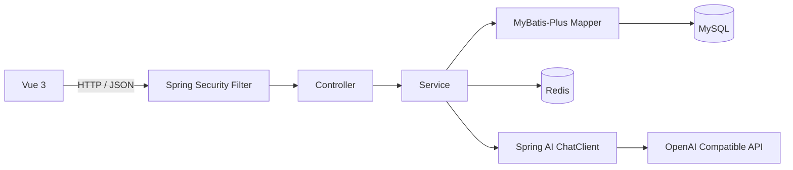

# AI TODO 智能任务管理系统


AI TODO 是一个前后端分离的智能任务管理系统。项目以个人 TODO 为基础，加入任务步骤、AI 任务建议、AI 步骤拆解、Redis 缓存与限流，并正在扩展小组协作能力。

项目采用 Spring Boot 单体架构，重点展示 REST API 设计、Spring Security JWT 认证、MyBatis-Plus 数据访问、Redis 工程化使用、Spring AI 模型接入以及小组成员权限控制。

## 已实现功能

### 用户与身份认证

- 用户注册、用户名或邮箱登录、查询当前用户
- BCrypt 密码摘要存储
- JWT 签发与校验
- Spring Security `OncePerRequestFilter` 统一认证
- 无状态会话，Controller 通过 `@AuthenticationPrincipal` 获取当前用户 ID
- 按客户端 IP 限制登录频率

### 个人任务管理

- 任务创建、详情查询、编辑、状态修改和删除
- `TODO`、`IN_PROGRESS`、`DONE` 三种状态
- `LOW`、`MEDIUM`、`HIGH` 三种优先级
- 标题、描述和截止时间
- 状态与优先级筛选、标题与描述搜索
- MyBatis-Plus 分页查询
- 今日截止、已逾期和指定时间范围内即将截止的任务查询
- 任务总数、状态、高优先级、今日截止和逾期统计

### 任务步骤

- 创建、查询、修改和删除步骤
- 修改步骤标题和完成状态
- 批量保存最多 10 个步骤
- 允许具有相同内容的重复步骤
- 删除任务时通过外键级联删除步骤

### AI 任务建议

用户可以自由描述当前情况，例如：

- “我现在有半小时，适合做些什么？”
- “根据截止时间和优先级安排今天剩余的任务。”
- “我现在不适合处理复杂工作，先推进哪些步骤？”

后端会查询当前用户未完成的任务及步骤，将状态、优先级和截止时间等真实业务数据与用户输入一起交给模型，再返回文字建议。

### AI 步骤草稿

- 根据任务标题、描述、优先级、截止时间和已有步骤生成结构化草稿
- 校验任务归属、步骤数量、标题长度和空内容
- 允许业务上合理的重复步骤
- AI 结果不会直接写入数据库
- 用户可以修改、删除、排序和选择草稿，再通过批量接口写入
- 批量写入使用事务，失败时整体回滚

### AI 调用记录

`ai_call_logs` 记录：

- 调用用户
- AI 功能类型
- 实际模型名称
- Prompt、Completion 和总 Token 数
- 调用耗时
- 成功状态和失败信息

日志保存失败不会覆盖原本的 AI 业务结果。

### Redis

- 缓存用户任务统计，TTL 为 1 分钟
- 创建、修改、修改状态或删除任务后主动删除统计缓存
- Redis 读取失败或缓存内容损坏时回退到 MySQL
- Redis 写入或缓存删除失败时保留数据库业务结果
- 使用 Lua 脚本原子完成计数、过期时间设置和限流判断
- 登录按 IP 限流，AI 请求按用户 ID 限流，当前均为每分钟最多 5 次

### 小组与成员

- 创建小组，创建者自动成为 `OWNER`
- 查询当前用户加入的小组、小组详情和成员列表
- OWNER 或 ADMIN 通过用户名或邮箱邀请用户
- 用户查询自己的待处理邀请并接受或拒绝
- 接受邀请时通过事务同时更新邀请状态并创建成员关系
- 普通成员和 ADMIN 可以退出小组
- OWNER 暂时不能退出，避免小组失去负责人
- OWNER 可以在 `ADMIN` 和 `MEMBER` 之间调整成员角色
- 禁止通过成员角色接口修改 OWNER

当前角色权限：

| 操作 | OWNER | ADMIN | MEMBER |
| --- | --- | --- | --- |
| 查看小组和成员 | 是 | 是 | 是 |
| 邀请用户 | 是 | 是 | 否 |
| 修改成员角色 | 是 | 否 | 否 |
| 退出小组 | 否 | 是 | 是 |

团队任务创建与负责人分配尚未实现。

## 系统架构



后端按照业务领域组织代码，每个领域内部再划分 Controller、Service、Mapper、Entity 和 DTO：

```text
com.qijx.aitodo
├── ai
├── common
├── group
├── task
└── user
```

## 技术栈

### 后端

| 技术 | 用途 |
| --- | --- |
| Java 17 | 后端开发语言 |
| Spring Boot 4.1.0 | 应用基础框架 |
| Spring Web MVC | REST API |
| Spring Security | JWT Filter 和接口认证 |
| Spring Validation | 请求参数校验 |
| MyBatis-Plus 3.5.16 | CRUD、条件构造和分页 |
| MySQL | 业务数据持久化 |
| Redis / Spring Data Redis | 缓存和限流 |
| Redis Lua | 原子限流 |
| Spring AI 2.0.0 | ChatClient 和结构化模型输出 |
| OpenAI Compatible API | 对接 DeepSeek 等模型服务 |
| java-jwt 4.5.2 | JWT 签发与解析 |
| BCrypt | 密码摘要 |
| Maven | 构建和依赖管理 |
| Lombok | 简化数据类 |

### 前端

| 技术 | 用途 |
| --- | --- |
| Vue 3 | 前端框架 |
| Vite 7 | 开发服务器和构建 |
| JavaScript | 页面逻辑 |
| Fetch API | 后端请求 |
| Lucide Vue | 图标 |
| vuedraggable | AI 步骤草稿排序 |
| 原生 CSS | 样式与响应式布局 |

## 项目目录

```text
ai-todo
├── backend
│   ├── database
│   │   └── schema.sql
│   ├── src/main/java/com/qijx/aitodo
│   │   ├── ai
│   │   ├── common
│   │   ├── group
│   │   ├── task
│   │   ├── user
│   │   └── AiTodoApplication.java
│   └── pom.xml
├── frontend
│   ├── src
│   │   ├── components
│   │   ├── composables
│   │   ├── services
│   │   ├── styles
│   │   ├── utils
│   │   ├── App.vue
│   │   └── main.js
│   └── package.json
├── docs
│   └── architecture.md
└── README.md
```

## 数据模型

| 表 | 用途 |
| --- | --- |
| `users` | 用户账号、密码摘要和状态 |
| `tasks` | 个人任务 |
| `task_steps` | 任务步骤 |
| `ai_call_logs` | AI 调用模型、Token、耗时和结果 |
| `task_groups` | 小组基本信息和负责人 |
| `task_group_members` | 小组成员及 OWNER、ADMIN、MEMBER 角色 |
| `task_group_invitations` | 小组邀请及处理状态 |

主要关系：

```text
users 1 ── N tasks
tasks 1 ── N task_steps
users 1 ── N ai_call_logs
users N ── N task_groups        通过 task_group_members
task_groups 1 ── N task_group_invitations
```

## 本地运行

### 环境要求

- JDK 17
- Node.js 20.19+ 或 22.12+
- MySQL 8
- Redis
- 可选：OpenAI API 兼容的大语言模型服务

### 1. 创建数据库

```sql
CREATE DATABASE ai_todo
    CHARACTER SET utf8mb4
    COLLATE utf8mb4_unicode_ci;
```

选择 `ai_todo` 后执行：

```text
backend/database/schema.sql
```

当前脚本中的 `tasks.title` 仍为 `VARCHAR(50)`，而后端请求校验允许 100 个字符。统一定义前需要执行：

```sql
ALTER TABLE tasks
    MODIFY COLUMN title VARCHAR(100) NOT NULL;
```

### 2. 配置后端

本地配置文件已加入 `.gitignore`。创建：

```text
backend/src/main/resources/application.properties
```

参考配置：

```properties
spring.application.name=ai-todo
server.port=8080

spring.datasource.url=jdbc:mysql://localhost:3306/ai_todo?useSSL=false&allowPublicKeyRetrieval=true&serverTimezone=Asia/Shanghai&characterEncoding=utf8
spring.datasource.username=root
spring.datasource.password=your_mysql_password
spring.datasource.driver-class-name=com.mysql.cj.jdbc.Driver

mybatis-plus.configuration.map-underscore-to-camel-case=true

spring.data.redis.host=localhost
spring.data.redis.port=6379

app.jwt.secret=${JWT_SECRET:replace-with-a-long-random-secret}
app.jwt.expiration-minutes=1440

spring.ai.model.chat=openai
spring.ai.openai.base-url=${DEEPSEEK_BASE_URL:https://api.deepseek.com}
spring.ai.openai.api-key=${DEEPSEEK_API_KEY:}
spring.ai.openai.chat.model=${DEEPSEEK_MODEL:deepseek-chat}
spring.ai.openai.chat.max-retries=2
```

如果后端运行在 WSL，而 MySQL 运行在 Windows，请将数据库地址中的 `localhost` 改为 WSL 可以访问的 Windows 主机地址。

建议通过环境变量提供密钥：

```bash
export JWT_SECRET='your-long-random-jwt-secret'
export DEEPSEEK_API_KEY='your-api-key'
export DEEPSEEK_BASE_URL='https://api.deepseek.com'
export DEEPSEEK_MODEL='deepseek-chat'
```

不使用 AI 时可以暂不设置 API Key，但 AI 接口不可用。

### 3. 启动 Redis

```bash
redis-cli ping
```

正常返回：

```text
PONG
```

Redis 不可用时，任务统计仍会回退到 MySQL；登录和 AI 限流采用失败关闭策略，对应请求会返回 `503 Service Unavailable`。

### 4. 启动后端

```bash
cd backend
./mvnw spring-boot:run
```

运行测试：

```bash
./mvnw clean test
```

后端默认地址：`http://localhost:8080`。

### 5. 启动前端

```bash
cd frontend
npm install
npm run dev
```

前端默认地址：`http://localhost:5173`，开发服务器默认将 `/api` 代理到 `http://localhost:8080`。

需要修改代理目标时，在 `frontend/.env` 中配置：

```properties
VITE_API_PROXY_TARGET=http://localhost:8081
```

## API 概览

注册和登录以外的接口需要请求头：

```http
Authorization: Bearer <JWT_TOKEN>
```

### 用户

| 方法 | 路径 | 说明 |
| --- | --- | --- |
| `POST` | `/api/users/register` | 注册 |
| `POST` | `/api/users/login` | 登录 |
| `GET` | `/api/users/me` | 当前用户 |

### 任务

| 方法 | 路径 | 说明 |
| --- | --- | --- |
| `POST` | `/api/tasks` | 创建任务 |
| `GET` | `/api/tasks` | 分页、筛选和搜索 |
| `GET` | `/api/tasks/stats` | 任务统计 |
| `GET` | `/api/tasks/reminders` | 查询即将截止任务 |
| `GET` | `/api/tasks/{id}` | 任务详情 |
| `PATCH` | `/api/tasks/{id}` | 编辑任务 |
| `PATCH` | `/api/tasks/{id}/status` | 修改状态 |
| `DELETE` | `/api/tasks/{id}` | 删除任务 |

### 任务步骤

| 方法 | 路径 | 说明 |
| --- | --- | --- |
| `POST` | `/api/tasks/{taskId}/steps` | 创建步骤 |
| `POST` | `/api/tasks/{taskId}/steps/batch` | 批量创建步骤 |
| `GET` | `/api/tasks/{taskId}/steps` | 查询步骤 |
| `PATCH` | `/api/tasks/{taskId}/steps/{stepId}` | 修改步骤 |
| `DELETE` | `/api/tasks/{taskId}/steps/{stepId}` | 删除步骤 |

### AI

| 方法 | 路径 | 说明 |
| --- | --- | --- |
| `POST` | `/api/ai/task-advice` | 根据用户输入和未完成任务生成建议 |
| `POST` | `/api/ai/tasks/{taskId}/step-drafts` | 生成结构化步骤草稿 |

### 小组与邀请

| 方法 | 路径 | 说明 |
| --- | --- | --- |
| `POST` | `/api/groups` | 创建小组 |
| `GET` | `/api/groups` | 查询我加入的小组 |
| `GET` | `/api/groups/{groupId}` | 查询小组详情 |
| `GET` | `/api/groups/{groupId}/members` | 查询成员 |
| `POST` | `/api/groups/{groupId}/invitations` | OWNER 或 ADMIN 发送邀请 |
| `DELETE` | `/api/groups/{groupId}/members/me` | 普通成员或 ADMIN 退出 |
| `PATCH` | `/api/groups/{groupId}/members/{memberUserId}/role` | OWNER 修改成员角色 |
| `GET` | `/api/group-invitations/pending` | 查询我的待处理邀请 |
| `POST` | `/api/group-invitations/{invitationId}/accept` | 接受邀请 |
| `POST` | `/api/group-invitations/{invitationId}/reject` | 拒绝邀请 |

## Redis Key

| Key | 用途 | TTL |
| --- | --- | --- |
| `task:stats:{userId}` | 用户任务统计缓存 | 1 分钟 |
| `rate_limit:login:{clientIp}` | 登录请求计数 | 1 分钟 |
| `rate_limit:ai:{userId}` | AI 请求计数 | 1 分钟 |

## 当前边界

- 项目仍是单体应用，没有引入微服务和分布式事务。
- 当前提醒功能是按时间范围查询，不是定时推送。
- 当前小组支持成员关系、邀请和角色，不支持团队任务分配。
- 当前只有基础 Spring 上下文测试，仍需补充 Service 和接口测试。
- Docker Compose、Nginx、消息队列和正式部署配置尚未实现。

## 后续计划

- [ ] 创建团队任务并指定负责人
- [ ] 查询“分配给我的任务”
- [ ] 更新团队任务进度和转交任务
- [ ] 增加小组操作记录与团队任务汇总
- [ ] 增加更完整的任务提醒机制
- [ ] 补充 Service 单元测试和接口测试脚本
- [ ] 使用 Docker Compose 编排 MySQL、Redis、后端和前端
- [ ] 增加 Nginx 和部署配置
- [ ] 在存在真实异步需求后引入 RabbitMQ

## 项目定位

> 一个基于 Spring Boot、Vue、MySQL、Redis 和 Spring AI 的智能任务管理系统，在个人任务管理基础上实现上下文感知的 AI 建议、可确认的任务拆解流程和基础小组协作。

该项目用于展示从普通 CRUD 向认证、缓存、原子限流、AI 工程化、事务一致性和业务权限控制逐步演进的后端开发过程。
