# AI TODO 系统架构说明

## 1. 文档说明

本文档描述 AI TODO 当前版本的系统架构、模块边界、核心调用流程、数据模型、缓存策略和已知问题。

本文档以仓库 `main` 分支的实际代码为准，主要用于：

- 帮助开发者快速理解项目结构
- 记录当前架构设计
- 说明各模块之间的调用关系
- 为后续重构提供依据
- 为项目介绍和面试准备提供技术材料

AI TODO 当前采用：

- Vue 3 单页前端
- Spring Boot 单体后端
- MySQL 持久化数据
- Redis 实现缓存和限流
- Spring AI 调用 OpenAI 兼容大模型服务

当前项目不是微服务架构，也没有引入消息队列、服务注册中心或 API Gateway。

---

## 2. 系统定位

AI TODO 是一个接入大语言模型的任务管理系统。

系统在传统任务管理功能之外，让 AI 能够读取用户真实的任务数据，包括：

- 任务标题
- 任务描述
- 任务状态
- 任务优先级
- 任务截止时间
- 任务执行步骤
- 步骤完成情况

AI 根据这些业务数据和用户输入生成任务安排建议，或者将一个任务拆解为可执行步骤。

系统的核心设计目标是：

> 让 AI 基于真实业务数据提供建议，而不是作为一个与任务系统相互独立的聊天窗口存在。

---

## 3. 系统上下文

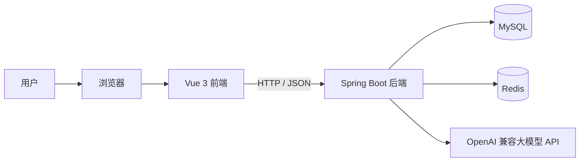

系统包含五个主要运行组件：

| 组件 | 主要职责 |
| --- | --- |
| Vue 前端 | 页面展示、用户交互、状态管理、接口调用 |
| Spring Boot 后端 | 身份认证、业务逻辑、数据访问、AI 调用 |
| MySQL | 持久化用户、任务和任务步骤 |
| Redis | 任务统计缓存、登录限流、AI 请求限流 |
| 大模型 API | 生成任务建议和任务步骤草稿 |

---

## 4. 当前部署形态

### 4.1 开发环境

开发环境下，前端和后端分别运行：

```text
Vue / Vite
http://localhost:5173

Spring Boot
http://localhost:8080
```

前端统一访问：

```text
/api/**
```

Vite 将 `/api` 请求代理到 Spring Boot：

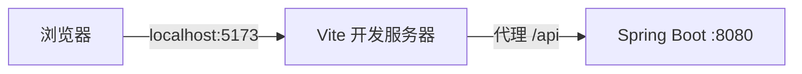

代理目标可以通过环境变量修改：

```properties
VITE_API_PROXY_TARGET=http://localhost:8080
```

### 4.2 生产环境

当前仓库没有提供完整的生产部署架构。

尚未包含：

- Dockerfile
- Docker Compose
- Nginx 配置
- HTTPS 配置
- CI/CD 配置
- 生产环境日志配置
- 健康检查接口

后续可以将前端构建为静态资源，并采用以下部署结构：

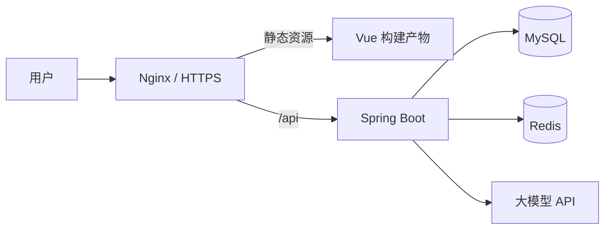

该结构属于后续建议，不是当前仓库已经实现的内容。

---

## 5. 仓库结构

```text
ai-todo
├── backend
│   ├── database
│   │   └── schema.sql
│   ├── src/main/java/com/qijx/aitodo
│   │   ├── ai
│   │   │   ├── controller
│   │   │   ├── dto
│   │   │   └── service
│   │   ├── common
│   │   │   └── config
│   │   ├── task
│   │   │   ├── controller
│   │   │   ├── dto
│   │   │   ├── entity
│   │   │   ├── mapper
│   │   │   └── service
│   │   ├── user
│   │   │   ├── controller
│   │   │   ├── dto
│   │   │   ├── entity
│   │   │   ├── mapper
│   │   │   └── service
│   │   └── AiTodoApplication.java
│   └── pom.xml
├── frontend
│   ├── src
│   │   ├── services
│   │   │   └── api.js
│   │   ├── App.vue
│   │   ├── main.js
│   │   └── styles.css
│   ├── package.json
│   └── vite.config.js
└── README.md
```

后端按照业务模块划分为：

```text
user
task
ai
common
```

每个业务模块内部再按照技术职责划分为 Controller、DTO、Service、Mapper 和 Entity。

这种方式可以称为：

> 按业务模块组织，在模块内部使用分层架构。

---

## 6. 后端总体架构

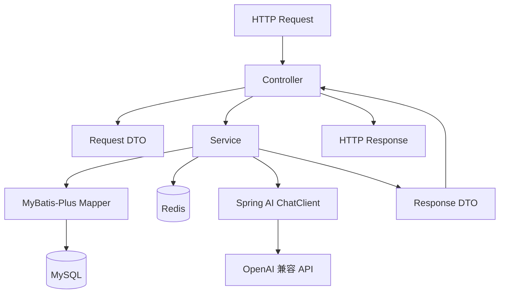

当前后端主要分为五层。

### 6.1 Controller

Controller 负责：

- 接收 HTTP 请求
- 读取路径参数和查询参数
- 读取请求体
- 触发参数校验
- 读取 `Authorization` 请求头
- 调用 Service
- 返回响应 DTO

当前 Controller 还承担了 JWT 解析工作。

例如受保护接口会执行：

```java
Long userId =
    jwtService.parseUserIdFromAuthorizationHeader(authorizationHeader);
```

Controller 不直接访问数据库，而是将解析得到的 `userId` 和业务参数传给 Service。

### 6.2 DTO

DTO 用于定义接口输入和输出。

主要包括：

```text
Request DTO
Response DTO
分页响应 DTO
AI 结构化响应 DTO
```

使用 DTO 的主要原因是：

- 避免直接暴露数据库实体
- 对接口参数进行校验
- 控制接口返回字段
- 隔离接口模型和数据库模型
- 为 AI 结构化输出提供目标类型

例如：

```text
TaskCreateRequest
TaskUpdateRequest
TaskResponse
TaskPageResponse
TaskStatsResponse
TaskStepDraftResponse
```

### 6.3 Service

Service 是当前系统的主要业务逻辑层。

Service 负责：

- 用户注册和登录
- 密码校验
- JWT 生成
- 任务 CRUD
- 用户数据归属校验
- 任务状态和优先级校验
- 任务统计计算
- Redis 缓存操作
- Redis 限流
- AI 提示词构建
- AI 返回结果校验

当前项目中大部分业务规则都集中在 Service。

### 6.4 Mapper

Mapper 继承 MyBatis-Plus 提供的基础 Mapper，负责数据库访问。

当前系统主要使用：

- `selectOne`
- `selectList`
- `selectCount`
- `selectPage`
- `insert`
- `updateById`
- `deleteById`
- `LambdaQueryWrapper`

当前没有单独编写 XML SQL 文件，大部分查询由 MyBatis-Plus 条件构造器完成。

### 6.5 Entity

Entity 与数据库表对应。

主要实体包括：

```text
User       -> users
Task       -> tasks
TaskStep   -> task_steps
```

MyBatis-Plus 默认将 Java 驼峰字段映射为数据库下划线字段。

例如：

```text
userId     -> user_id
passwordHash -> password_hash
createdAt  -> created_at
updatedAt  -> updated_at
```

---

## 7. 后端业务模块

### 7.1 user 模块

`user` 模块负责用户账号和身份认证。

主要类：

```text
UserController
UserService
JwtService
LoginRateLimitService
UserMapper
User
```

主要功能：

- 用户注册
- 用户名或邮箱登录
- BCrypt 密码摘要
- JWT 生成和解析
- 当前用户查询
- 用户状态检查
- 登录请求限流

### 7.2 task 模块

`task` 模块负责任务和任务步骤管理。

主要类：

```text
TaskController
TaskStepController
TaskService
TaskStepService
TaskMapper
TaskStepMapper
Task
TaskStep
```

主要功能：

- 任务 CRUD
- 任务分页
- 任务搜索
- 状态筛选
- 优先级筛选
- 任务统计
- 截止提醒查询
- 任务步骤管理
- 任务数据归属校验

### 7.3 ai 模块

`ai` 模块负责大语言模型相关能力。

主要类：

```text
AiAdviceController
AiAdviceService
AiTaskStepDraftService
AiRateLimitService
```

主要功能：

- 根据真实任务数据生成安排建议
- 将指定任务拆解为步骤草稿
- 构建发送给大模型的上下文
- 将大模型输出转换为 DTO
- 校验 AI 返回内容
- 限制用户的 AI 请求频率

### 7.4 common 模块

`common` 模块保存跨业务模块的公共配置。

当前主要包含：

```text
MybatisPlusConfig
```

该配置注册 MyBatis-Plus 分页插件，并指定数据库类型为 MySQL。

---

## 8. 前端架构

前端采用 Vue 3 和 Vite。

当前主要文件职责如下：

| 文件 | 职责 |
| --- | --- |
| `main.js` | 创建并挂载 Vue 应用 |
| `App.vue` | 页面状态、页面结构和主要交互逻辑 |
| `services/api.js` | 统一封装后端 API 请求 |
| `styles.css` | 全局页面样式 |
| `vite.config.js` | Vite 服务和开发代理配置 |

当前前端还没有使用：

- Vue Router
- Pinia
- Vuex
- Axios
- 独立页面组件目录
- 独立业务状态管理层

页面逻辑和状态主要集中在 `App.vue` 中。

### 8.1 API 请求封装

所有接口调用经过：

```text
frontend/src/services/api.js
```

统一请求函数会：

1. 从 `localStorage` 读取 JWT。
2. 自动添加 `Authorization` 请求头。
3. 在存在请求体时添加 `Content-Type: application/json`。
4. 调用浏览器 Fetch API。
5. 根据响应类型解析 JSON 或文本。
6. 将后端错误转换为适合页面展示的中文信息。

请求链路：

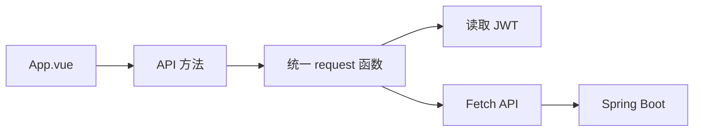

JWT 保存在：

```text
localStorage.aiTodoToken
```

### 8.2 前端状态

当前主要状态包括：

- 当前登录用户
- 当前任务列表
- 当前任务详情
- 当前任务步骤
- 任务分页信息
- 任务统计信息
- 搜索和筛选条件
- 截止提醒
- AI 建议
- AI 步骤草稿
- 加载状态
- 错误和成功提示
- 详情侧栏宽度

这些状态目前主要由 Vue 的：

```text
ref
reactive
computed
watch
```

进行管理。

---

## 9. 用户注册流程

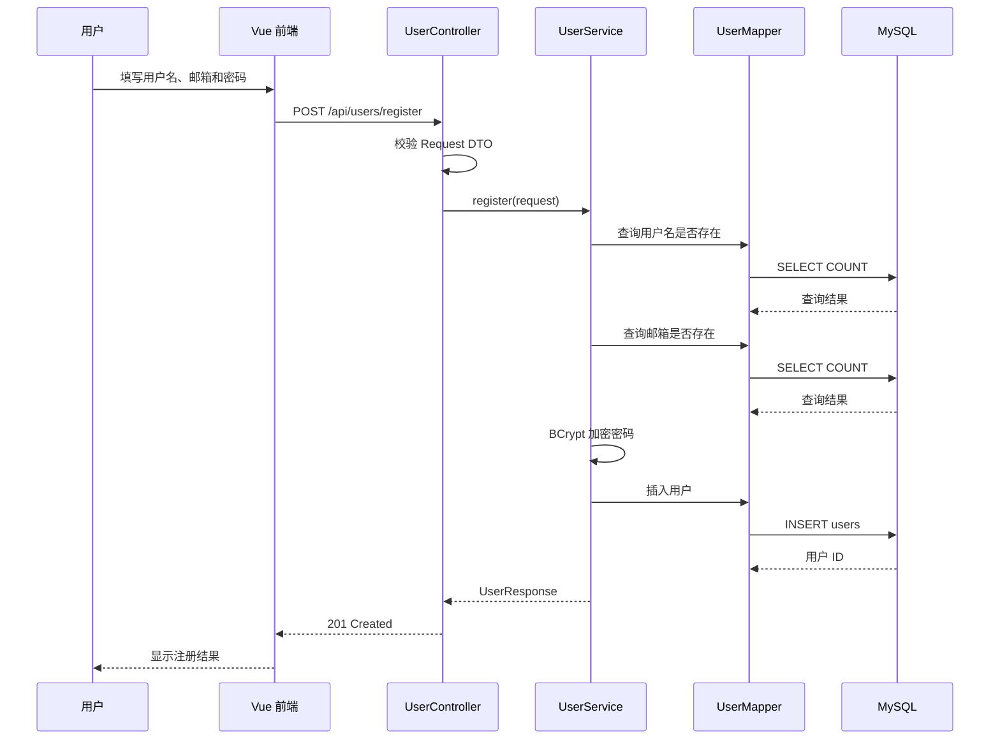

密码不会以明文形式存入数据库。

数据库只保存：

```text
password_hash
```

---

## 10. 用户登录流程

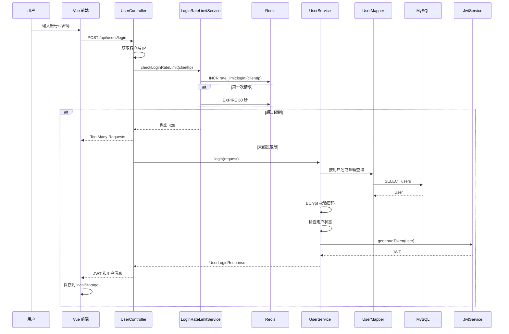

登录支持：

```text
用户名 + 密码
邮箱 + 密码
```

登录前会以客户端 IP 为维度执行限流。

---

## 11. JWT 认证流程

### 11.1 JWT 内容

当前 JWT 使用 HMAC SHA-256 签名。

令牌包含：

| 字段 | 内容 |
| --- | --- |
| `sub` | 用户 ID |
| `username` | 用户名 |
| `iat` | 签发时间 |
| `exp` | 过期时间 |

签名密钥来自：

```properties
app.jwt.secret
```

过期时间来自：

```properties
app.jwt.expiration-minutes
```

### 11.2 受保护接口流程

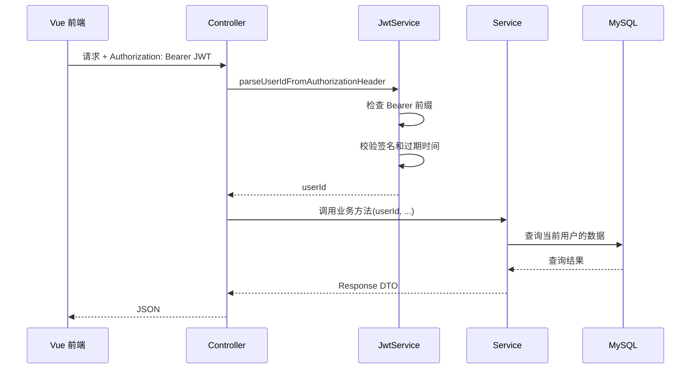

当前项目没有使用统一的认证过滤器或拦截器。

因此，每个受保护 Controller 都需要重复：

```java
Long userId =
    jwtService.parseUserIdFromAuthorizationHeader(authorizationHeader);
```

当前 JWT 认证架构可以表示为：

```text
Controller
    ├── 读取 Authorization
    ├── 调用 JwtService
    ├── 获得 userId
    └── 将 userId 传给业务 Service
```

---

## 12. 任务查询流程

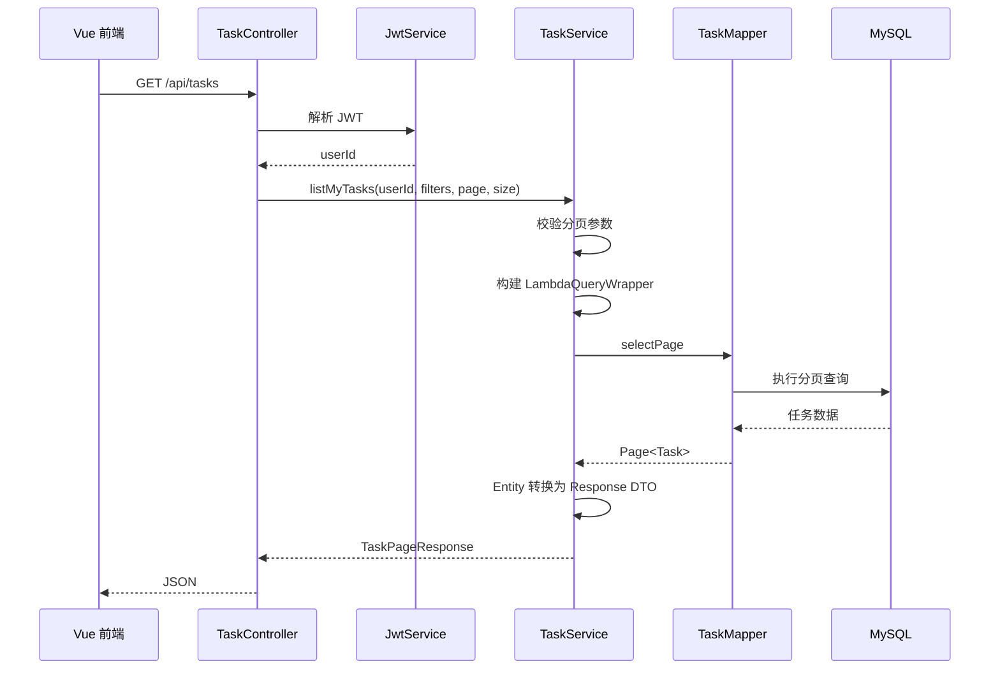

任务查询始终包含：

```java
.eq(Task::getUserId, userId)
```

从而保证用户只能访问自己的任务。

任务列表支持：

- 状态筛选
- 优先级筛选
- 标题和描述关键词搜索
- 分页
- 按创建时间倒序排列

---

## 13. 用户数据隔离

当前系统没有复杂的角色权限模型。

主要权限规则是：

> 用户只能访问属于自己的任务和任务步骤。

### 13.1 任务权限校验

任务查询通常同时使用：

```text
task.id = 请求中的任务 ID
task.user_id = JWT 中的用户 ID
```

对应查询条件：

```java
.eq(Task::getId, taskId)
.eq(Task::getUserId, userId)
```

如果没有查询到任务，统一返回“任务不存在”。

这种方式不会向请求者暴露：

- 任务确实不存在
- 任务存在但属于其他用户

### 13.2 步骤权限校验

任务步骤本身没有 `user_id`。

步骤权限通过父任务间接确定：

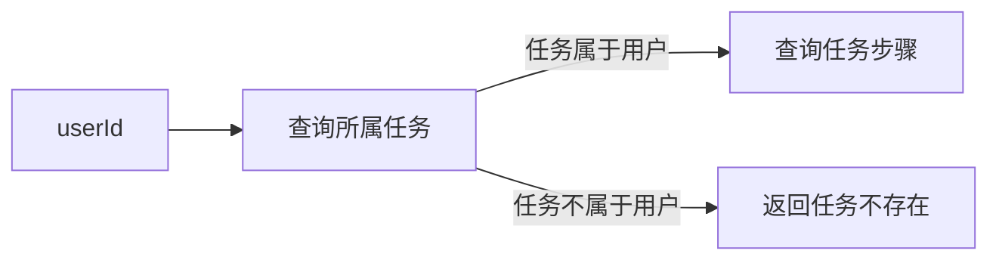

每次操作任务步骤时：

1. 根据 `taskId` 和 `userId` 检查任务归属。
2. 根据 `taskId` 和 `stepId` 查询步骤。
3. 执行创建、修改或删除操作。

---

## 14. 任务统计缓存

任务统计包括：

- 任务总数
- 待办任务数
- 进行中任务数
- 已完成任务数
- 高优先级任务数
- 今日截止任务数
- 已逾期任务数

由于统计接口需要执行多次数据库计数查询，系统将结果缓存到 Redis。

缓存 Key：

```text
task:stats:{userId}
```

缓存有效期：

```text
1 分钟
```

### 14.1 查询流程

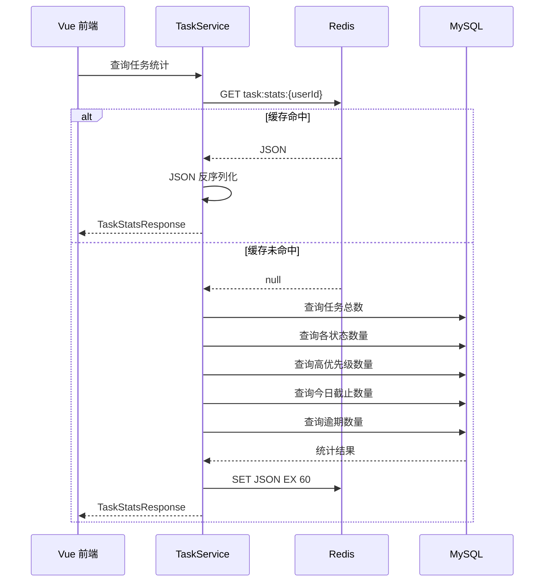

当前实现属于 Cache Aside 模式。

### 14.2 缓存失效

以下操作会删除任务统计缓存：

- 创建任务
- 编辑任务
- 修改任务状态
- 删除任务

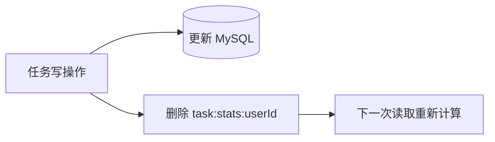

当前没有缓存任务列表，只缓存任务统计结果。

---

## 15. 截止提醒查询

截止提醒不是定时任务，也不会主动向用户发送通知。

当前实现是一个查询接口：

```text
GET /api/tasks/reminders?minutes=60
```

后端查询满足以下条件的任务：

```text
属于当前用户
状态不为 DONE
截止时间大于或等于当前时间
截止时间小于当前时间加指定分钟数
```

查询范围限制为：

```text
1 至 1440 分钟
```

因此当前提醒功能本质上是：

> 前端主动请求后端，后端返回指定时间范围内即将截止的任务。

当前没有：

- 后台调度器
- 邮件通知
- WebSocket 推送
- 浏览器推送
- 消息队列
- 系统级通知

---

## 16. AI 任务建议架构

AI 任务建议接口：

```text
POST /api/ai/task-advice
```

### 16.1 调用流程

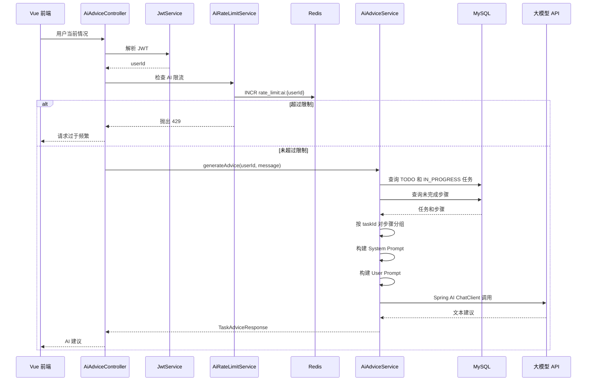

### 16.2 提供给 AI 的上下文

系统会将以下信息写入提示词：

```text
当前时间
用户输入
任务 ID
任务标题
任务描述
任务状态
任务优先级
截止时间
未完成的任务步骤
```

AI 只查询：

```text
TODO
IN_PROGRESS
```

状态的任务。

已经完成的任务不会被加入 AI 建议上下文。

### 16.3 AI 约束

System Prompt 要求模型：

- 参考用户提供的时间和精力
- 综合考虑截止时间、优先级和状态
- 优先关注临近截止和高优先级任务
- 不编造不存在的任务或步骤
- 最多推荐三个任务或步骤
- 使用简洁的中文回答

该功能返回普通文本，而不是结构化任务操作指令。

AI 不能通过该接口直接修改任务。

---

## 17. AI 任务拆解架构

AI 任务拆解接口：

```text
POST /api/ai/tasks/{taskId}/step-drafts
```

该功能负责将一个任务拆解为可执行步骤。

### 17.1 调用流程

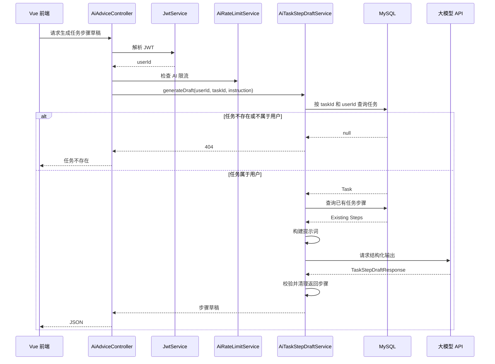

### 17.2 AI 输入

提示词包含：

- 任务标题
- 任务描述
- 任务优先级
- 任务截止时间
- 用户额外拆解要求
- 当前任务已有步骤

已有步骤会发送给 AI，避免模型重复生成。

### 17.3 结构化输出

任务拆解使用 Spring AI：

```java
.entity(TaskStepDraftResponse.class)
```

将模型输出转换为 Java DTO。

返回结构类似：

```json
{
  "steps": [
    "确认任务目标",
    "整理所需资料",
    "完成核心实现",
    "检查最终结果"
  ]
}
```

后端会检查：

- 返回对象是否为空
- `steps` 是否存在
- 步骤列表是否为空
- 步骤数量是否过多
- 是否存在空步骤
- 步骤标题是否超过 100 个字符

### 17.4 草稿确认机制

AI 返回的步骤不会立即写入数据库。

完整流程是：

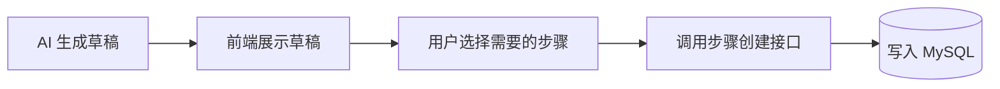

这种设计将 AI 定位为建议工具，而不是拥有数据库写权限的自动执行者。

---

## 18. Redis 架构

当前 Redis 承担两类职责：

```text
缓存
限流
```

### 18.1 Redis Key

| Key | 用途 | TTL |
| --- | --- | --- |
| `task:stats:{userId}` | 用户任务统计缓存 | 1 分钟 |
| `rate_limit:login:{clientIp}` | 登录请求计数 | 1 分钟 |
| `rate_limit:ai:{userId}` | AI 请求计数 | 1 分钟 |

### 18.2 登录限流

限流维度：

```text
客户端 IP
```

限制：

```text
每分钟最多 5 次
```

### 18.3 AI 限流

限流维度：

```text
用户 ID
```

限制：

```text
每分钟最多 5 次
```

### 18.4 当前限流算法

当前采用固定窗口计数：

```text
INCR key

如果 count == 1：
    EXPIRE key 60 秒

如果 count > 5：
    返回 429
```

该实现简单，适合当前单体项目。

它不属于：

- 令牌桶
- 漏桶
- 滑动窗口
- Redis Lua 原子限流
- 分布式网关限流

---

## 19. 数据库架构

### 19.1 实体关系

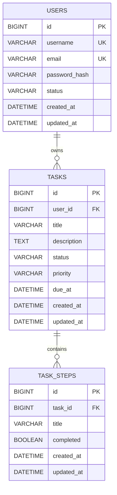

### 19.2 users 表

`users` 保存用户账号信息。

重要约束：

```text
username 唯一
email 唯一
```

用户状态当前使用字符串：

```text
ACTIVE
```

代码中还会判断非 `ACTIVE` 用户为被禁用状态。

### 19.3 tasks 表

`tasks` 保存任务信息。

任务状态：

```text
TODO
IN_PROGRESS
DONE
```

任务优先级：

```text
LOW
MEDIUM
HIGH
```

主要索引：

```text
idx_tasks_user_id
idx_tasks_user_status
```

这些索引适用于：

- 按用户查询任务
- 按用户和状态查询任务

### 19.4 task_steps 表

`task_steps` 保存任务执行步骤。

每个步骤通过：

```text
task_id
```

关联任务。

数据库外键配置了：

```sql
ON DELETE CASCADE
```

删除任务时，对应步骤由数据库级联删除。

---

## 20. 参数校验

项目使用 Jakarta Validation 对请求 DTO 进行校验。

常见校验包括：

- `@NotBlank`
- `@Size`
- `@Email`
- `@Valid`

除了 DTO 校验，Service 中还包含业务校验，例如：

- 页码不能小于 1
- 每页数量必须在 1 至 50 之间
- 任务状态必须是合法值
- 任务优先级必须是合法值
- 提醒范围必须在 1 至 1440 分钟之间
- 修改步骤时至少提供一个字段
- AI 返回步骤不能为空
- AI 返回步骤不能过长

可以将两类校验区分为：

```text
DTO 校验：检查请求数据的基本格式
Service 校验：检查业务规则
```

---

## 21. 异常处理

当前主要使用：

```java
throw new ResponseStatusException(...)
```

常见状态码：

| 状态码 | 场景 |
| --- | --- |
| `400` | 请求参数或业务参数错误 |
| `401` | JWT 缺失、无效或过期 |
| `403` | 用户账号被禁用 |
| `404` | 任务或步骤不存在 |
| `429` | 登录或 AI 请求过于频繁 |
| `502` | 外部 AI 服务调用失败 |

当前没有统一的：

```text
GlobalExceptionHandler
统一错误响应 DTO
统一业务异常类
错误码体系
```

前端的 `api.js` 会尝试从以下字段提取错误信息：

```text
detail
reason
message
error
errors
```

如果后端没有返回明确消息，前端会根据 HTTP 状态码显示默认中文提示。

---

## 22. 当前架构优点

### 22.1 业务模块划分清晰

代码按照：

```text
user
task
ai
```

划分业务模块，比将所有 Controller、Service 和 Entity 分别堆在一起更容易理解。

### 22.2 Controller 和业务逻辑基本分离

Controller 主要处理 HTTP 参数和身份解析，核心业务逻辑位于 Service。

### 22.3 Service 不依赖 HTTP 请求头

虽然 Controller 当前手动解析 JWT，但解析后只将 `userId` 传给 Service。

因此 TaskService 不需要依赖：

```text
HttpServletRequest
Authorization Header
JWT 字符串
```

业务层与 HTTP 细节保持了一定程度的解耦。

### 22.4 用户数据隔离较明确

任务查询普遍同时使用：

```text
taskId
userId
```

任务步骤操作也会先检查父任务归属。

### 22.5 AI 读取真实业务上下文

AI 建议不是只转发用户输入，而是会查询 MySQL 中的真实任务和步骤。

### 22.6 AI 不直接修改数据库

AI 任务拆解只返回草稿，最终保存动作由用户确认。

### 22.7 Redis 使用场景明确

Redis 当前只承担：

- 高频统计结果缓存
- 登录限流
- AI 限流

没有为了使用 Redis 而缓存所有数据。

### 22.8 前端接口调用集中管理

所有后端请求集中在 `services/api.js` 中，避免在页面各处重复处理 JWT、JSON 和错误响应。

---

## 23. 当前架构问题与风险

以下内容描述当前代码存在的架构问题，不表示系统已经实现相应改进。

### 23.1 JWT 解析逻辑重复

每个受保护 Controller 都需要：

```java
@RequestHeader("Authorization")
```

并手动调用 JwtService。

问题包括：

- 重复代码较多
- 容易遗漏认证
- Controller 需要了解 JWT 格式
- 后续增加权限规则时修改范围较大

建议后续使用：

- Spring MVC `HandlerInterceptor`
- Servlet Filter
- Spring Security Filter Chain

将认证逻辑统一处理。

### 23.2 被禁用用户的旧 JWT 可能继续访问业务接口

用户状态在登录和 `/api/users/me` 中会被检查。

但是任务和 AI 接口目前只校验 JWT 签名和过期时间，不会重新查询用户状态。

因此，一个用户在 JWT 有效期间被禁用后，理论上仍可能使用旧 JWT 访问任务和 AI 接口。

后续统一认证时，应在认证流程中检查：

```text
用户是否存在
用户状态是否为 ACTIVE
```

### 23.3 数据库脚本和实体字段不完全一致

当前 `schema.sql` 中用户更新时间字段为：

```text
update_at
```

而 Java 实体字段为：

```text
updatedAt
```

MyBatis-Plus 默认会映射到：

```text
updated_at
```

两者不一致。

此外，任务创建 DTO 允许任务标题最长 100 个字符，但数据库脚本中：

```text
tasks.title VARCHAR(50)
```

这可能导致通过后端校验的数据在写入数据库时失败。

数据库脚本、DTO 和实体定义应保持一致。

### 23.4 删除任务时缓存失效顺序存在并发风险

当前删除任务的大致顺序是：

```text
删除统计缓存
删除数据库任务
```

在两个操作之间，如果出现并发统计查询，可能发生：

1. 缓存已被删除。
2. 数据库任务尚未删除。
3. 并发请求重新计算旧统计数据。
4. 旧统计数据重新写入缓存。
5. 随后任务才被删除。

结果可能是缓存中的旧数据继续存在最多一分钟。

更安全的顺序通常是：

```text
先修改数据库
再删除缓存
```

对于更严格的一致性要求，可以进一步考虑延迟双删或消息通知。

### 23.5 Redis 限流的 INCR 和 EXPIRE 不是原子操作

当前限流会分别执行：

```text
INCR
EXPIRE
```

如果程序在两条命令之间异常退出，理论上可能出现没有过期时间的限流 Key。

更可靠的实现可以使用 Redis Lua 脚本，将计数和设置过期时间放入同一个原子操作。

### 23.6 代理环境下客户端 IP 可能不准确

登录限流使用：

```java
httpServletRequest.getRemoteAddr()
```

如果后端部署在 Nginx 或其他反向代理之后，读取到的可能是代理服务器 IP。

生产环境需要正确处理可信代理提供的：

```text
X-Forwarded-For
X-Real-IP
```

同时不能无条件信任客户端自行传入的这些请求头。

### 23.7 TaskService 手动创建 ObjectMapper

当前 TaskService 内部直接：

```java
new ObjectMapper()
```

这会绕过 Spring Boot 对 Jackson 的统一配置。

如果后续增加：

- Java Time 配置
- 自定义序列化器
- 命名策略
- 日期格式
- 全局 Jackson 模块

该 ObjectMapper 可能与 HTTP 层的 ObjectMapper 行为不一致。

建议通过构造器注入 Spring 管理的 ObjectMapper。

### 23.8 AI Service 直接依赖 Mapper

当前 AI Service 直接读取：

```text
TaskMapper
TaskStepMapper
```

优点是实现简单。

但这也意味着 AI 模块需要了解任务模块的数据访问细节，并可能重复任务模块的查询规则。

随着项目扩大，可以考虑增加专门的只读上下文服务，例如：

```text
TaskContextQueryService
```

由它统一提供 AI 所需的任务上下文。

### 23.9 缺少明确事务边界

当前 Service 没有明显使用：

```java
@Transactional
```

大部分操作是单表操作，暂时影响不大。

但未来如果出现：

- 创建任务并同时创建默认步骤
- 删除任务并写入操作日志
- 批量保存 AI 草稿
- 修改任务并发送通知
- 同时更新多个聚合数据

就需要明确事务边界。

### 23.10 前端 App.vue 职责过多

当前登录、任务列表、详情、步骤、提醒和 AI 功能主要集中在同一个 `App.vue` 中。

随着功能增长，会出现：

- 文件过大
- 状态相互影响
- 修改风险增加
- 组件难以复用
- 测试困难

后续可以拆分为：

```text
components/auth
components/tasks
components/steps
components/ai
components/common
```

### 23.11 缺少统一异常响应格式

当前后端主要依赖 Spring 默认错误结构和 `ResponseStatusException`。

前端因此需要兼容多个错误字段。

建议统一为类似：

```json
{
  "code": "TASK_NOT_FOUND",
  "message": "任务不存在",
  "timestamp": "2026-07-27T16:00:00",
  "path": "/api/tasks/1"
}
```

### 23.12 缺少自动化测试

当前架构尚未形成完整测试体系。

建议补充：

- Service 单元测试
- Controller 接口测试
- Mapper 集成测试
- Redis 集成测试
- AI 返回结果校验测试
- 用户数据越权测试

---

## 24. 建议的重构顺序

### 第一阶段：修复正确性问题

优先处理：

1. 统一 `updated_at` 字段名称。
2. 统一任务标题长度。
3. 调整删除任务和删除缓存的顺序。
4. 通过 Spring 注入 ObjectMapper。
5. 为主要 Service 增加基础测试。

### 第二阶段：统一身份认证

增加统一认证层：

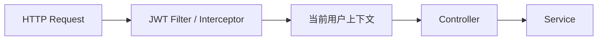

目标是让 Controller 不再重复解析 JWT。

同时统一检查：

- JWT 是否存在
- JWT 是否有效
- JWT 是否过期
- 用户是否存在
- 用户是否为 ACTIVE

### 第三阶段：统一异常处理

增加：

```text
GlobalExceptionHandler
BusinessException
ErrorResponse
业务错误码
```

将参数错误、认证错误、资源不存在和外部服务异常统一转换为稳定的 JSON 响应。

### 第四阶段：拆分前端组件

建议拆分：

```text
frontend/src
├── components
│   ├── auth
│   ├── tasks
│   ├── steps
│   ├── ai
│   └── common
├── composables
├── services
├── utils
├── App.vue
└── main.js
```

如果未来出现多个独立页面，再引入 Vue Router。

如果跨组件共享状态明显增多，再考虑 Pinia。

### 第五阶段：补充工程化能力

可以继续增加：

- OpenAPI / Swagger
- Docker Compose
- GitHub Actions
- 日志和请求追踪
- 健康检查
- 配置分环境管理
- 数据库迁移工具
- 性能测试
- 安全测试

---

## 25. 建议遵守的架构规则

后续开发建议遵守以下规则。

### Controller

Controller 应该：

- 只处理 HTTP 输入输出
- 不直接访问 Mapper
- 不编写复杂业务逻辑
- 不直接拼装大型 AI Prompt
- 不处理缓存细节

### Service

Service 应该：

- 负责业务规则
- 负责数据归属校验
- 负责事务边界
- 只接收 `userId`，不接收完整 JWT
- 不依赖前端页面结构

### Mapper

Mapper 应该：

- 只负责数据库访问
- 不包含业务规则
- 不处理 JWT
- 不调用外部 AI 服务

### DTO

DTO 应该：

- 与接口语义对应
- 不直接代替 Entity
- 包含必要的基础格式校验
- 避免返回密码摘要等敏感字段

### AI 模块

AI 模块应该：

- 只能读取经过权限校验的数据
- 不允许模型编造数据库实体
- 对结构化输出进行后端校验
- 对外部服务异常进行转换
- 默认生成草稿，而不是直接执行高影响写操作
- 控制输入上下文长度和调用频率

### Redis

Redis 应该：

- 用于适合缓存或限流的数据
- 设置合理的 TTL
- 明确缓存失效策略
- 避免将 Redis 作为唯一持久化来源
- 在生产环境关注原子性和并发一致性

---

## 26. 架构总结

AI TODO 当前是一个结构较清晰的前后端分离单体应用。

其主要调用链为：

```text
Vue 前端
    ↓
Spring MVC Controller
    ↓
Service
    ↓
MyBatis-Plus Mapper
    ↓
MySQL
```

Redis 作为辅助基础设施，负责：

```text
任务统计缓存
登录请求限流
AI 请求限流
```

Spring AI 负责：

```text
构建模型请求
调用 OpenAI 兼容接口
接收文本或结构化结果
```

当前最有代表性的架构特点是：

1. AI 能够读取用户真实任务数据。
2. 用户数据通过 `userId` 进行隔离。
3. AI 拆解结果先作为草稿返回。
4. Redis 同时用于缓存和限流。
5. 后端按照业务模块和技术分层组织。
6. 前端通过统一 API 模块管理请求和 JWT。

当前架构能够支持现有功能，但随着功能继续增加，最需要优先改进的是：

```text
统一 JWT 认证
统一异常处理
修复数据库定义不一致
明确事务和缓存一致性
拆分大型前端组件
补充自动化测试
```

在完成这些改进后，项目仍然可以继续保持单体架构。

对于当前规模而言，良好组织的单体应用比过早拆分微服务更简单、更稳定，也更适合作为后端开发学习和实习面试项目。
````
